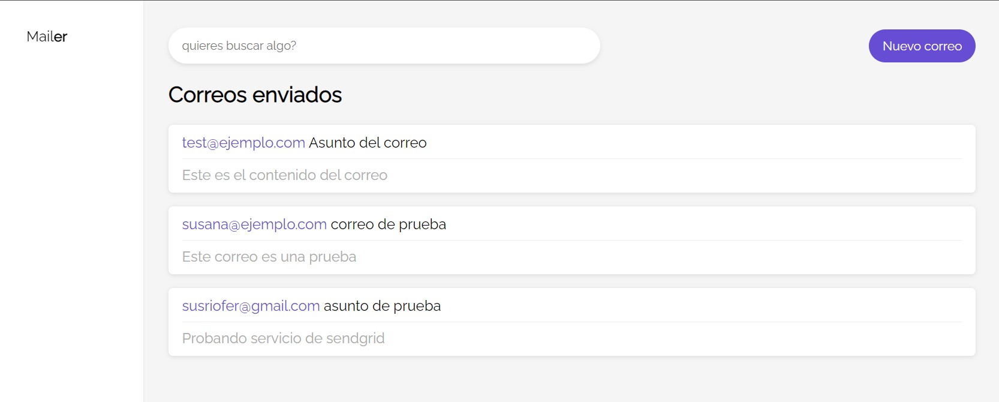
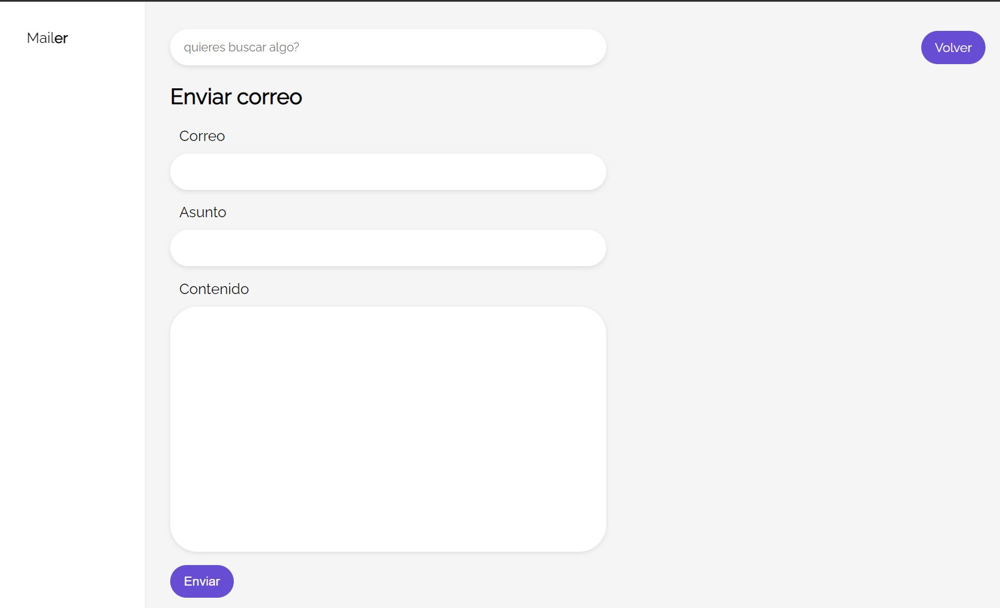

# mailerapp
Aplicación para envío de correos. Conectividad con bbdd añadida para llevar inventario de correos enviados

Como funcionalidad extra, se puede buscar cualquier texto entre los correos enviados para que nos muestre aquellos que nos puedan interesar.

La idea es añadirlo en bloque a una aplicación mayor para dotar a esta de la funcionalidad de gestión de correo.

